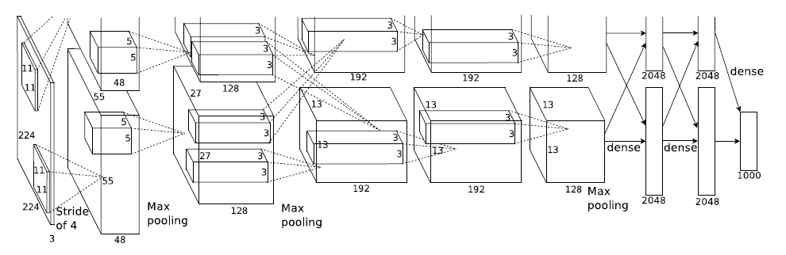

# ImageNet Classification with Deep Convolutional Neural Networks

## Abstract
- max-pooling layer, dropout 등을 적용하여 ILSVRC-2012에서 큰 차이로 1등을 차지

## Introduction
- 기존의 (라벨링된) 이미지 데이터셋들은 수만개 정도의 이미지에 불과
  - 이런 간단한 인식 작업의 경우 기존의 머신러닝 방법 + 적절한 증강을 통해서 충분히 좋은 성능이 나왔음(MNIST 등)
- 그러나 현실의 객체의 경우 가변성이 더 크기 때문에 더 큰 training set를 필요로 함
- 대규모의 데이터셋(LabelMe, ImageNet 등)은 최근(논문 작성 당시 기준)에서야 구축

 

- 수백만장의 이미지에서 수천가지의 객체를 학습하기 위해서는 큰 학습 용량이 필요
- 그렇기 때문에 저자들은 CNN을 선택
  - 깊이, 폭 등을 제어하여 다양한 이미지 특성을 파악할 수 있기 때문
  - 비슷한 레이어를 가진 feedforward network와 비교했을 때 더 적은 연결과 파라미터를 가졌기 때문에 학습시키기 쉽다.

 

- 이러한 장점에도 불구하고, 고해상도 이미지를 CNN으로 처리하기 위해서는 비싼 비용이 필요
  - 2D convoluton 연산에 최적화된 GPU를 사용

 

## Dataset

- ImageNet 데이터셋은 약 22000개의 카테고리, 1500만장 이상의 라벨링된 고해상도 이미지
- ImageNet Large-Scale Visual Recognition Challenge(ILSVRC)라는 이미지 분류 대회에 사용
  - top-1, top-5 error rate를 평가
- 다양한 해상도의 이미지를 포함, 그러나 이 논문의 시스템은 고정된 해상도를 요구하기 때문에 모든 이미지를 256x256의 해상도로 downsample
  - 직사각형 이미지의 경우 짧은 변의 길이를 256픽셀로 한 뒤, 가운데에서 256x256 사이즈로 crop하여 사용
- 다른 전처리 과정 없이 raw RGB 값을 그대로 사용하여 학습

 

## Architecture
- 8개의 레이어로 구성
  - 5개의 convolutional layer, 3개의 fully-connected layer

### ReLU Nonlinearity
- 뉴런의 출력에 주로 사용되는 활성화 함수(비선형 함수)는 $f(x) = tanh(x)$ 또는 $f(x) = (1 + e^{-x})^{-1}$
  - 경사하강법의 학습 시간 측면에서 이러한 saturating nonlinearity 함수(아래서 설명)는 non-saturating nonlinearity 함수 $f(x) = max(0,x)$에 비해서 더 느리다

> ## saturating nonlinearity vs non-saturating nonlinearity  
> - non-saturating nonlinearity 함수: 어떤 입력 $x$가 무한대로 갈 때 함수의 값이 무한대로 가는 함수  
> ex. ReLU 
> - saturating nonlinearity 함수: 어떤 입력 $x$가 무한대로 갈 때 함수의 값이 어떤 범위 내에서 만 움직이는 함수 (공역? 치역?의 범위에 제한이 있다)  
> ex. sigmoid, tanh
>
> ### non-saturating의 정의 
> - $f$ is non-saturating iff $(|\lim_{z \rightarrow -\infty}f(z)| = +\infty) \lor (|\lim_{z \rightarrow \infty}f(z)|= +\infty)$  

- ReLU(Rectified Linear Unit)를 활성화 함수로 사용
  - ReLU를 사용하는 CNN 네트워크가 tanh를 사용하는 네트워크에 비해 학습이 수렴하는 속도가 몇 배 더 빠르다
- 다른 연구에서도 활성화 함수를 대체하려는 연구는 있었으나 학습 속도를 위해 적용한 것은 처음이다.

### Training on Multiple GPUs
- GTX 580 3GB를 사용
  - 전체 데이터셋을 하나의 GPU에 올리기에는 용량이 부족하다
  - 저자들은 두 개의 GPU를 사용
  - GPU는 시스템 메모리를 거치지 않고 서로의 메모리에서 직접 읽고 쓸 수 있음 &rarr; 병렬화에 적합
- 특정 레이어에서만 2개의 GPU가 서로 데이터를 교환 가능하도록, 나머지 레이어는 같은 GPU로부터 연산을 이어받음

### Local Response Normalization
- ReLU는 포화(기울기가 점점 작아지는 현상)를 방지하기 위해 정규화를 필요로 하지 않음
  - 양수인 input이 조금이라도 있다면 학습이 진행된다
- 하지만 저자들은 일반화에 도움이 되는 새로운 로컬 정규화 방식을 도입

$$ b^i_{x,y}  = a^i_{x,y} / \left(k + \alpha \sum\limits_{j=max(0,i-n/2)}^{min(N-1,i+n/2)}(a^j_{x,y})^2 \right)^\beta $$

- $a^i_{x,y}$ : 위치 $(x,y)$에 커널 $i$를 적용한 다음 ReLU를 적용 &rarr; 뉴런 $a$의 출력
- $b^i_{x,y}$ : 정규화된 출력 $b$, 주어진 식은 $n$개의 인접 커널 맵에 걸쳐 실행(동일한 공간 위치?)
- $k$, $n$, $\alpha$, $\beta$는 hyperparameter
- LRN 적용 후 성능이 더 좋아짐을 확인(top-1 에러에서 1.4%, top-5 에러에서 1.2%의 성능 향상)

- **batch normalization의 등장으로 현재는 잘 사용하지 않음**

### Overlapping Pooling

- CNN에서의 풀링 레이어는 같은 커널 내의 인접한 뉴런의 출력을 요약
- 전통적으로 풀링 레이어의 커널을 겹쳐서 사용하지 않음
- 하지만 저자들은 풀링 레이어의 커널들을 서로 겹치게 설정함으로써 더 높은 성능을 거둠(stride = 2, 3x3 kernel 사용)

### Overall Architecture

- 전체 네트워크는 총 8개의 가중치 레이어로 구성
  - 첫 5개의 레이어는 convolutional layer, 나머지 3개의 레이어는 fully-connected layer
  - 마지막 fc 레이어의 출력은 1000개의 출력을 가진 softmax &rarr; 1000개의 클래스에 대응
- 2, 4, 5번째 convolutional layer는 동일한 GPU의 이전 레이어에만 연결 되어있음
- 3번째 레이어는 두번째 레이어의 모든 커널 맵과 연결되어 있음(두 개의 GPU 모두 해당하는듯)
- fc 레이어의 경우 이전 레이어의 모든 뉴런과 연결되어 있음
- Response normalization 레이어(LRN)는 첫번째와 두번째 conv 레이어 뒤에 옴
- Max pooling layer의 경우 LRN 레이어와 5번째 conv 레이어 뒤에 옴
- 모든 conv 레이어와 fc 레이어가 ReLU 활성화 함수를 사용
  - 레이어 구조는 conv - ReLU - (LRN) - (max-pooling) 레이어 순서  

- First Convolutional Layer(Conv-1)
  - input : 227 * 227 * 3(논문에는 224 * 224 * 3으로 나와있는데 실제는 227이라고함)
  - 11 * 11 * 3 kernel size, 96개의 커널
  - stride 4px
  - padding 0px
  - output : 55 * 55 * 96
  

  
Convolutional layer의 output

  - 입력 데이터: $W_1 \times H_1 \times D_1$ ($W_1$: 가로, $H_1$: 세로, $D_1$: 채널의 수)
  - 필터(커널)의 수: $K$
  - 필터의 크기(가로=세로): $F$
  - 스트라이드: $S$
  - 패딩: $P$
    
  - 출력
    - $W_2 = (W_1 - F + 2P)/S+1$
    - $H_2 = (H_1 - F + 2P)/S+1$
    - $D_2 = K$
  - 가중치의 수: $[F_2 \times D_1 + D_1] \times K$

- First Max-Pooling Layer(MaxPool-1)
  - input : 55 * 55 * 96
  - 3 * 3 kernel size
  - stride 2px
  - output : 27 * 27 * 96($input-kernel/stride+1$)
  
- Second Convolutional Layer(Conv-2)
  - input : 27 * 27 * 96
  - 5 * 5 kernel size, 256개
  - stride 1px
  - padding 2px
  - output : 27 * 27 * 256

- Second Max-Pooling Layer(MaxPool-2)
  - input : 27 * 27 * 256
  - 3 * 3 kernel size
  - stride 2px
  - output : 13 * 13 * 256
  
- Third Convolutional Layer(Conv-3)
  - input : 13 * 13 * 256
  - 3 * 3 kernel size, 384개
  - stride 1px
  - padding 1px
  - output : 13 * 13 * 384
  
- 4th Convolutional Layer(Conv-4)
  - 3rd Convolutional Layer와 동일
  
- 5th Convolutional Layer(Conv-5)
  - input : 13 * 13 * 384
  - 3 * 3 kernel size, 256개
  - stride 1px
  - padding 1px
  - output : 13 * 13 * 256
  
- 3rd Max-Pooling Layer(MaxPool-3)
  - input : 13 * 13 * 256
  - 3 * 3 kernel size
  - stride 2px
  - output : 6 * 6 * 256
  
- 1st Fully-Connected Layer(FC-1)
  - 4096개의 뉴런
- 2nd Fully-Connected Layer(FC-2)
  - 4096개의 뉴런
- 3rd Fully-Connected Layer(FC-3)
  - 1000개의 뉴런

- 최종 output : 1000 * 1

## Reducing Overfitting

### Data Augmentation
- 가장 쉽고 흔한 오버피팅을 줄이는 방법: 인공적인 방법으로 데이터셋의 크기를 키우는 것
- 저자들은 서로 다른 두가지 형태를 도입
  - 두가지 방법 모두 원본 이미지에 아주 적은 연산만으로 적용 가능, 별도의 저장공간도 필요 x
  - GPU를 통해 이전 배치의 이미지를 학습하는 동시에 변환된 이미지를 CPU를 통해 생성

- 첫번째 데이터 증강 방식: horizontal reflection(수평 반사), image translations?
  - 256x256 이미지에서 무작위로 227x227 패치를 추출 &rarr; 수평 반사
  - 데이터셋의 크기를 2048배로 만들어줌(10개의 패치 추출 * 수평 반사 2 해서 2048배인듯)
  - 테스트 시에는 5개의 패치(4개의 코너, 가운데)를 추출 &rarr; 수평 반사 &rarr; 10개의 이미지에 대한 예측 수행 후 평균을 내서 결과를 냄

- 두번째 데이터 증강 방식
  - RGB 채널의 강도를 변경 (픽셀 값에 대한 PCA 적용)
  - PCA를 적용하고 평균 0, 표준편차 0.1을 갖는 가우시안 분포에서 랜덤 변수를 추출한 후, 원래 픽셀 값에 곱해주어 색상을 변형시킴
    - 이미지의 각 픽셀 값 $I_{xy} = [I^R_{xy},I^G_{xy},I^B_{xy}]$에 $[\mathbf{p_1, p_2, p_3}][\alpha_1\lambda_1,\alpha_2\lambda_2,\alpha_3\lambda_3]^T$ 값이 추가됨
    - $\mathbf{p_i}, \lambda_i$ : (이미지 내의?) RGB 픽셀 값의 3x3 공분산 행렬에 대한 i번째 고유벡터(eigenvector)와 고유값(eigenvalue)
    - $\alpha_i$ : 무작위 확률 변수

  - 자연물의 경우 조명이 바뀌거나 색상이 변해도 물체의 정체성이 변하지 않는 다는 점에서 착안하여 적용한 증강 방식
  - top-1 error에서 1% 이상 성능 향상
  
### Dropout
- 다양한 모델의 예측을 결합(앙상블) : 성능을 높이는 매우 성공적인 방법이지만 비용이 너무 많이 든다
- 그래서 저자들은 더욱 효율적인 모델 조합 방법 - dropout을 도입
- 은닉층의 각 뉴런에 대해서 일정 확률로 뉴런의 출력을 0으로 함
  - 'dropped out'된 뉴런들은 전방향 연산, 역전파 연산에 아무런 영향을 미치지 못함
  - 이를 통해 서로 다른 구조의 모델을 학습 시키는 것과 유사한 효과를 낸다
- 테스트 시에는 모든 뉴런 사용, 출력에 1-dropout rate를 곱해줌(해당 논문에서는 0.5)
- 처음 두 fc-layer에 대해서 dropout을 적용해서 overfitting을 방지하는 효과를 얻음

## Details of learning
- batch size 128, momentum 0.9, weight decay 0.0005인 sgd(확률적 경사 하강법) 사용
  - 저자들은 작은 값의 weight decay를 사용하는것이 중요하다고 함
  - 단순한 정규화, 규제가 아닌 모델 자체의 성능을 향상시켜주는 역할을 함
  
  $$v_{i+1} := 0.9 \cdot v_i - 0.0005 \cdot \epsilon \cdot w_i - \epsilon \cdot \Big \langle \frac{\partial L}{\partial w} |_{w_i} \Big \rangle _{D_i}$$

  $$w_{i+1} := w_i + v_{i+1}$$

  - $i$ : iteration index, $v$ : momentum variable, $\epsilon$ : learning rate
  - $\Big \langle \frac{\partial L}{\partial w} |_{w_i} \Big \rangle$ : $i$번째 배치에서 목적 함수의 $w$에 대한 도함수의 평균($w_i$의 시점에서)
- 가중치 초기화: 각각의 레이어를 평균 0, 표준편차 0.01인 가우시안 분포 사용
- 2, 4, 5번째 conv layer, fc layer의 편향(bias)를 1로 초기화
  - 이 초기화 방법은 ReLU에 positive input을 부여하여 초기 학습을 가속함
- 나머지 뉴런의 편향은 0으로 초기화

- 모든 레이어에 동일한 학습률 사용
  - 학습률은 수동으로 조정
  - 현재의 학습률에서 성능 향상이 없으면 학습률을 10으로 나눠줌 &rarr; 학습 마무리까지 총 3번 이루어짐

## Results
- ILSVRC-2010과 2012에서의 결과 나열

### Qualitative Evalutaions(정성적 평가)
- 두 개의 GPU 중 GPU1의 커널들은 대체로 색상에 구애받지 않는 반면(color-agnostic), GPU2의 커널들의 경우 색상에 구애받는 경우(color-specific)가 많았음
- 객체가 중앙에서 벗어난 이미지의 경우에도 적절한 결과를 냄
- 대부분의 top-5 label이 합리적
- 틀린 답을 낸 경우 사람이 보기에도 모호한 경우가 많았음
- 마지막 4096차원 fc-layer(fc2)의 output을 비교하여 유사한 값을 내는 이미지들은 실제로 유사한 이미지를 반환함
  - 4096차원 벡터에 대한 오토인코더를 학습시켜서 벡터간 비교의 효율성 향상 가능

## Discussion
- deep convolutional network를 사용해서 복잡한 dataset에서 우수한 성능을 기록한 것이 의미가 있음
  - 어느 한 개의 레이어를 삭제해도 성능이 떨어짐

- 저자들은 궁극적으로 비디오 시퀀스에 deep convolutional network를 적용하고 싶어함